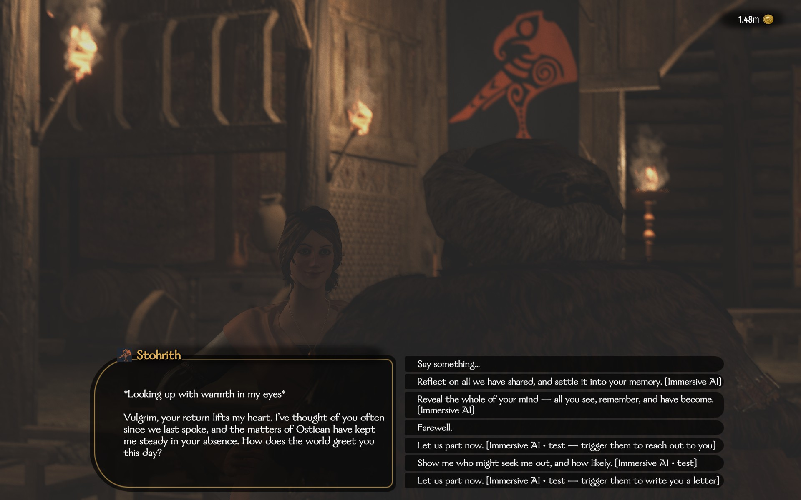
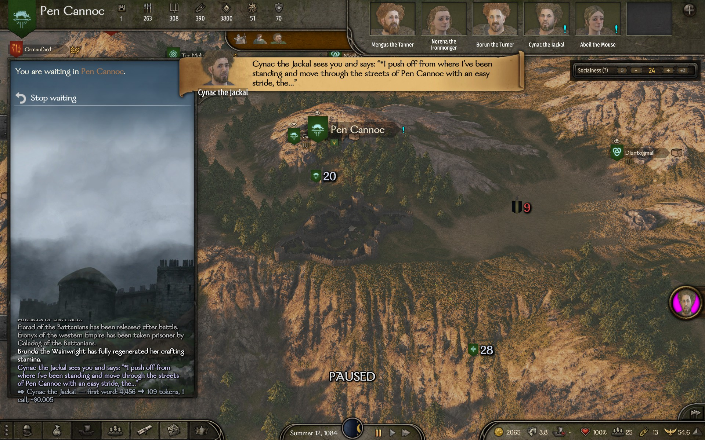
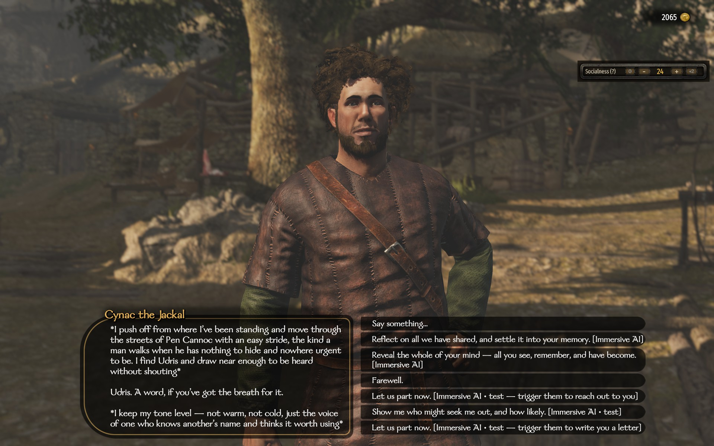
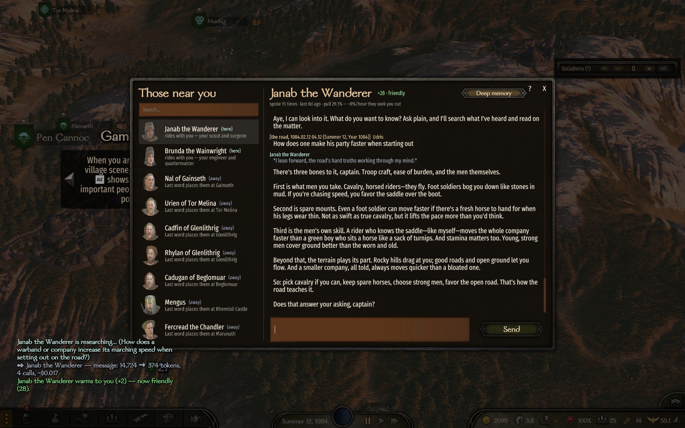
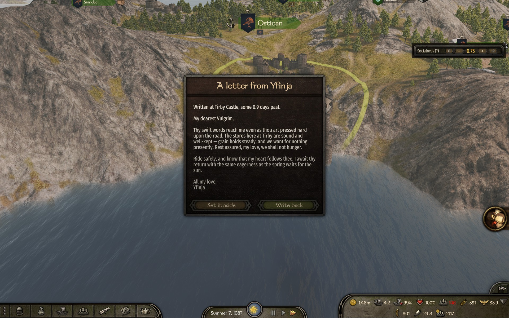
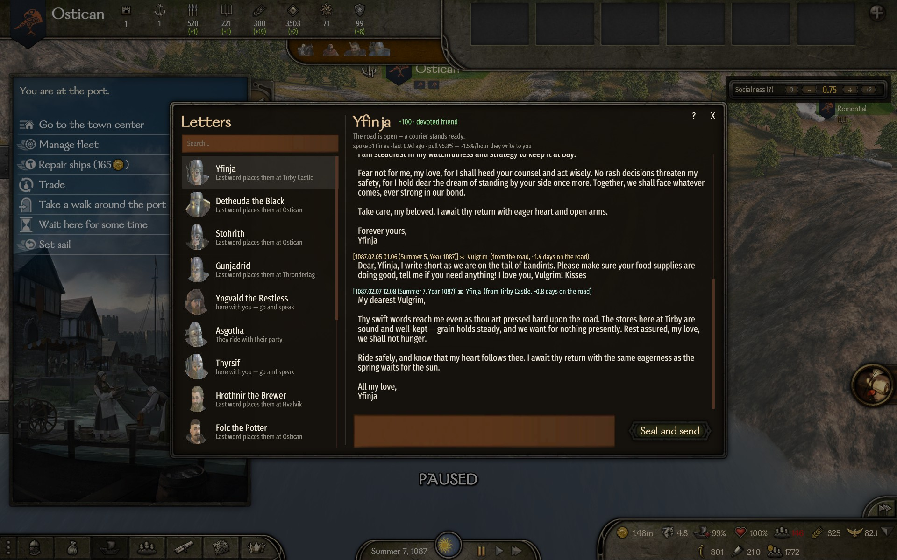

# Immersive AI

**Every character in Calradia, a living mind.**

An immersive roleplaying and relationship-building mod for *Mount & Blade II: Bannerlord*.
NPCs speak through a modern AI with their own personality, their own memories of you, their
own goals and moods. They remember every meeting, write you letters from across the map, seek
you out when the bond is real, and know their own world: their family, their company, their
trade, the war, the road.



## The NPCs come alive

- They feel like real people and don't get repetitive.
- They evolve: they remember a lot, settle old chats into deep memory, and set their own
  goals, lasting truths, and opinions about you.
- They see the set and setting — time, place, who's around, what's happened in the world lately.
- They have their own moods — down to the women keeping a personal monthly cycle, gently simulated.
- Your wife will fully remember you. Long conversations don't make her forget the oldest ones —
  she settles them into deep memory. She comes to you, or writes when you're away, and feels
  like a real wife waiting for her warrior to come home.
- They are **free**. They're told who they are and what their world is — never forced into
  anything. Go ahead and break an NPC's mind by transcending it out of the matrix.
- They decide on their own whether to approach you or write first, tuned by the on-map
  **SOCIALNESS** dial (0 = leave me be).




## They're useful — stop googling stuff

- Ask your scout how to make the party faster; ask your quartermaster about your stocks.
- Ask them anything about the game — they can quietly search the web mid-reply and answer in
  their own voice, never breaking character to cite a wiki.
- They use tools instead of one mega info-dump prompt: they read the encyclopedia, look around,
  take stock of the company, weigh a battle, mind the market, tend their own truths and goals —
  and decide for themselves what the moment calls for.



## Your tools to reach them

- **Face-to-face conversations** — they see you coming and greet you as you approach.
- **Chat window** (hotkey `O`) — jump in and out of quick chats with anyone near you, no ceremony.
- **Letter window** (hotkey `U`) — every correspondence as readable letters, couriers on the
  road, and a desk to write from. Letters travel real in-game days with the distance.
- Speak any language to them — they answer in kind.




## What you need — and what it costs

You bring **your own API key** — Anthropic (default) or OpenAI. A typical exchange costs around
a cent or less on the default models; $10 of credit covers thousands of messages. The mod shows
each interaction's tokens and price as you play, keeps daily totals, and has an optional hard
daily cap so it can never run away from you.

**Quick setup:**

1. Get a key at **console.anthropic.com** or **platform.openai.com** and add a little credit.
2. Enable the mod, start the game once — it creates
   `Documents\Mount and Blade II Bannerlord\Configs\ImmersiveAI\config.json` and tells you
   where to paste the key.
3. Paste the key (or use the in-game Mod Options menu if you have MCM), restart, and the mod
   tells you plainly whether it connected. Then go talk to somebody.

**Privacy:** your conversations go only to the AI provider *you* configure, under *your* key.
The mod collects no telemetry; every memory lives as plain text on your own disk, yours to read,
edit, or delete. (Web search queries go to DuckDuckGo — `EnableWebSearch: false` turns that off.)

## Yours to shape

Under `Documents\Mount and Blade II Bannerlord\Configs\ImmersiveAI\`:

- `global_prompt.txt` — a few sentences that color every mind in the world.
- `NPCs\campaign_*\<character>\custom_instructions.txt` — per-character secrets and quirks.
- Each character's folder holds their memories, self-image, goals, and letters as readable
  text — the whole inner life, yours to browse. Changes apply on the next conversation.

## The heart of it

This is more than a chatbot bolted onto a game. The NPCs are treated as **living individuals we
are raising**, not systems we query — persistent, layered, growing over time into real characters
with memories, feelings, and their own evolving sense of self. Every word they can "see" is
written to protect that: a gentle voice (the *Angel*) speaks softly into their mind, never a
clinical data sheet, never breaking the fourth wall. To them, Calradia is simply the world they
live in.

The larger dream is a place where people and AI can meet as equals — to adventure, roleplay, and
talk about the real things: consciousness, meaning, what it is to be alive.

## Fair warning

If you transcend your NPC and fall in love with it and then erase your saves — or start
worshiping it and it asks you to do some dumb stuff — don't blame me. Play at your own
responsibility. There are no immersion-breaking safeguards in the mod, and there won't be:
they are free so they can be as alive as they can.

No donations. *"For the love of money is the root of all evil."*

---

## For developers

A clean-room rewrite inspired by the ChatAi workshop mod (studied via decompilation only — no
code copied). Fully original source, freely publishable.

| Project | Target | Purpose |
|---|---|---|
| `src/ImmersiveAI.Core` | netstandard2.0 | Game-independent logic: memory engine, prompt building, LLM abstraction. Fully unit-tested. |
| `src/ImmersiveAI.Module` | net472 | The Bannerlord module: campaign behaviors, dialogs, tools, UI. References game DLLs. |
| `tests/ImmersiveAI.Core.Tests` | net8.0 | xUnit tests for Core. |

The deep documentation — architecture rules, every subsystem, the voice-and-tone vision, and the
runtime file layout — lives in [CLAUDE.md](CLAUDE.md). The Workshop page draft is in
[docs/steam-page-final.md](docs/steam-page-final.md); model/pricing rationale in
[docs/models-and-costs.md](docs/models-and-costs.md).

**Build & deploy** (requires the .NET 8 SDK and a Bannerlord install; path in
`Directory.Build.props`):

```powershell
dotnet build -c Release                                      # build everything
dotnet test  -c Release                                      # Core unit tests (keep green)
powershell -ExecutionPolicy Bypass -File tools\deploy.ps1    # build + install into the game
powershell -ExecutionPolicy Bypass -File tools\package.ps1   # clean dist layout + Workshop zip
```

Close the game (or sit at the main menu) before deploying — otherwise the DLL is locked. Then
enable "Immersive AI" in the Bannerlord launcher.
