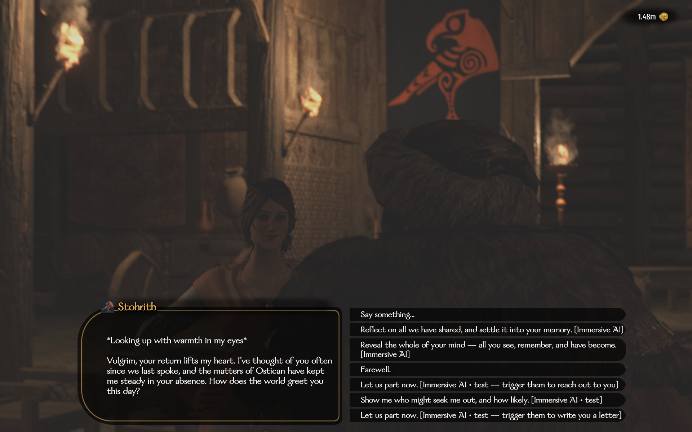
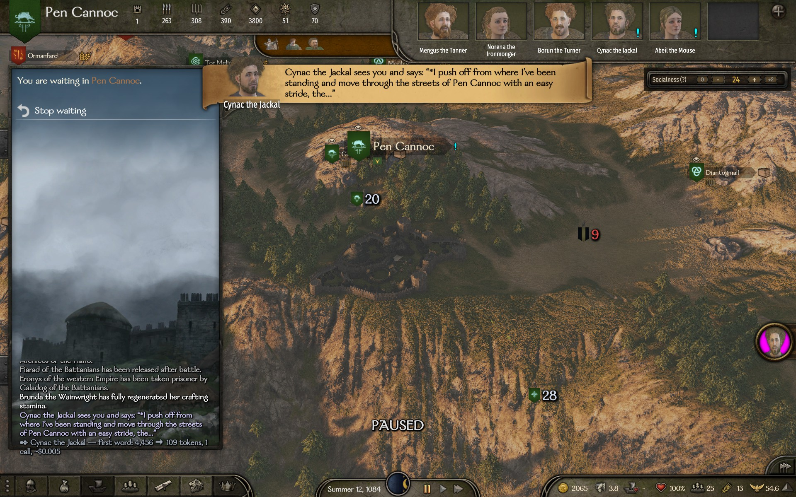
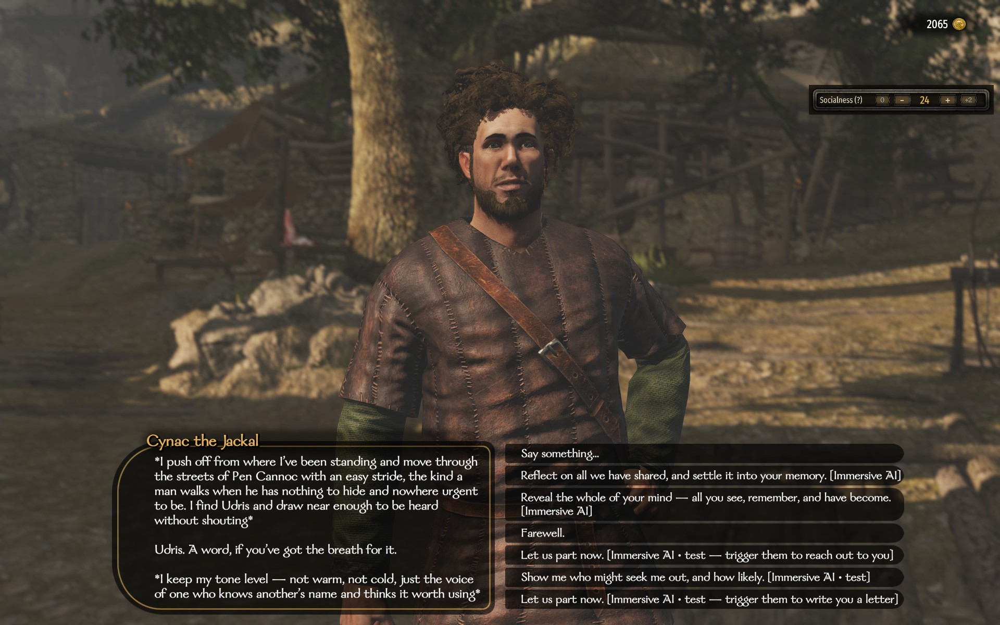
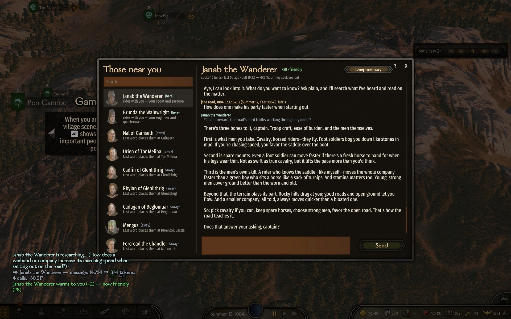
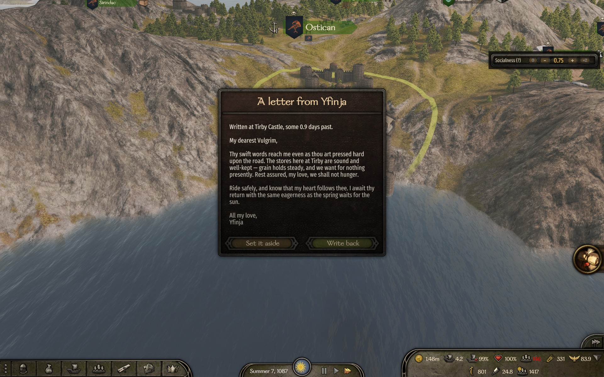
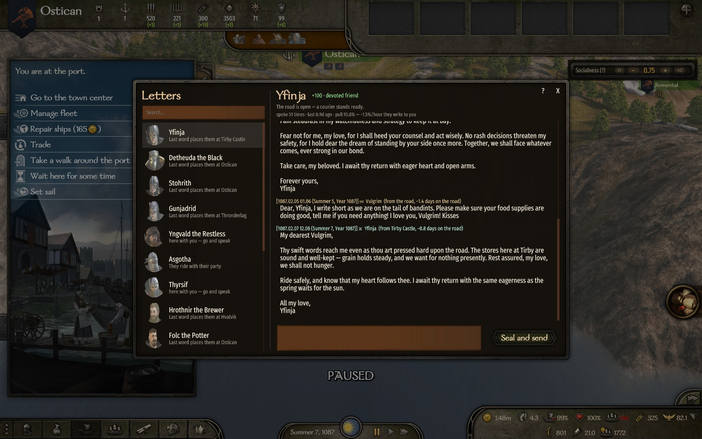

# Immersive AI

**Every character in Calradia, a living mind.**

A roleplaying and relationship mod for *Mount & Blade II: Bannerlord*. Characters speak through
the AI you configure — each with their own voice, memory, moods and sense of self. They remember every
meeting, seek you out, write letters from across the map, and know their world: their family,
their company, their trade, the war, the road.




## Looking for…?

If one of these searches brought you here — yes, this is that mod:

- **AI dialogue** in Bannerlord — talk to any NPC through the AI you choose
- NPCs with **real long-term memory** — they remember you across conversations and campaigns' worth of talks
- NPCs that **approach you** and **write you letters** on their own
- an **AI wife or companion** that roleplays and never forgets your story — **courted and married
  in conversation**, companions included
- **voiced NPCs** — hear them speak, in voices of their own people: clone your own or use hosted ones
- asking about **game mechanics in-game** instead of alt-tabbing to Google
- **never knowing what to say?** one key and your own hero drafts your next line for you
- **OpenRouter** (recommended), OpenAI, Gemini, DeepSeek or Claude — or, for tinkerers only, a
  **local model (LM Studio / Ollama)** at your own risk


## Alive

- Distinct voices, no repetition — and when you leave a letter unanswered, they hear the silence and hold their peace.
- They grow: recent talks stay word-for-word, old ones settle into one deep memory they rewrite in their own words — the names, promises and debts between you — alongside their own sense of self and their opinion of you.
- Every soul begins as somebody: at your first meeting, a private starting truth is written for them — an old wound, an odd habit, a vanity — grown from their real story, traits and your world prompt. It lands in their own editable prompt file, yours to read, rewrite or erase.
- They see the moment — time, place, who stands near, what lately happened in the world.
- They have moods — down to the women keeping a personal monthly cycle, gently simulated.
- They remember your battles: everyone who fought at your side keeps the day in memory — who downed whom, who bled, what was won — the last battle fresh in detail, the older ones by name ("what happened at the storming of Varcheg?"), all drawn from a real chronicle the mod writes for every fight, sea-battles included.
- Your companions witness the everyday road too: the towns you called at, the trade you struck ("we sold wool for 900 denars in Ortysia"), the men you hired or left on walls, the captives sold — and the tasks you carry, each remembered later as succeeded or failed, and why.
- They know their own body — how far their wounds have mended, when they're in no state to fight — and they see yours.
- Your wife remembers your whole story. She comes to you, or writes when you're away — a real wife waiting for her warrior.
- They are **free**: told who they are and what their world is, never forced. Go ahead and break one's mind by transcending it out of the matrix.
- They decide when to approach or write first — you set the pace with the on-map **SOCIALNESS** dial (0 = leave me be).





## Court them. Wed them. Hire them.

- **Marriage by courtship.** Win a heart in conversation and it walks its own road — liking, love,
  readiness, betrothal, wedding — one honest step at a time, moved by their own judgment of your
  talks, not by a menu.
- **They write their own misgivings.** When marriage truly enters your talks, they set down what
  honestly worries them about a life together, in their own words (up to five, or none at all if
  their heart is clear). Talk them over openly; only they decide when life has answered one, laying
  it to rest with a note on what settled it. Their readiness waits until nothing they wrote still
  stands. You see the count under their name and can open the whole list.
- **Station guards the hand, not the heart.** A great house's daughter may come to love anyone, but
  her hand asks a suitor of standing — softened once her heart is fully won. Her family's blessing
  costs a bride-price, haggled in real talk or by letter.
- **Companion brides and grooms** — vanilla forbids them; here they are the point. Wed the wanderer
  riding at your side and she is raised to lordship the game's own way, keeping her place and duties
  in your party.
- **Hiring by handshake.** Agree service and price with an unhired wanderer in the talk itself. They
  open at their worth, concede only what your words have earned, and never volunteer their lowest
  price — quoting the game's own real numbers, not invented ones.
- **Nothing is sealed by words alone.** Every bargain, betrothal and wedding takes your confirming
  click, and the wedding is the real game marriage — cutscene, clan, children and all. Offers can
  even ride letters and be sealed when the courier arrives.
- **And the wedding day is written down.** Not a line in a log — a story, told in the manner of the
  old Scriptures and in whatever tongue you speak together: the hall, the hour, who stood there,
  the road that brought you both. The one you wed remembers it, and so does everyone who was there.
  A second part — the night that followed, in your beloved's own voice — belongs to the two of you
  alone and reaches no one else, ever. Years later, ask them about that day and they will tell it
  back to you whole.
- **And then the nights are yours.** Each evening a notice waits on the map asking where you will
  sleep, and her own month decides what may come of it — a child is begun on a night you chose,
  not by a hidden daily roll. Bring wine or a jewel and that night is written down and given a
  name she keeps it by; the grander it was, the likelier your other wives are to hear of it, and
  of its name. Every wife keeps her own fortnight of nights — the ones you came, the ones her
  door was closed, and whatever she learned of the rest.


## Useful — stop googling stuff

- Ask your scout how to make the party faster; ask your quartermaster about the stocks.
- Ask anything about the game — they can quietly search the web mid-reply and answer in their own voice, never citing a wiki.
- They reach for tools instead of one mega info-dump prompt: the encyclopedia, a look around, the muster roll, the scales of battle, the market ledger, the chronicle of your battles — deciding for themselves what the moment calls for.




## Reaching them

- **Face to face** — they see you coming and greet you as you approach.
- **One talk screen** (hotkey `O` or `Y`) — everyone you know in one list — near, far or gone — and
  the one you choose drawn there alive, the way the game draws a talk on the map. Words if they can
  hear you, a letter riding real in-game days if they cannot, one thread for both. (The two older
  windows survive behind a setting.)
- **Hear them** — a play mark beside every line, and a Voices page to cast anyone: voices ship with
  the mod, clone your own locally, or use hosted ones by the minute. Off by default.
- The screen edits a character's own prompt, or the whole world's, **without leaving the game** — it speaks from the very next reply.
- **Think** (Shift+Enter) — stuck for words? Your own hero drafts your next line from everything the two of you have said; it lands in your writing box to keep, change or bin. Standing presets steer it: *starter*, *romantic*, *ender*, or your own.
- Any language in, the same language out.





## What it runs on — and what it costs

Bring **your own API key**. Pick a row:

| If you want… | Pick | Key from |
|---|---|---|
| **It to just work** | OpenRouter + `openai/gpt-5.6-luna` — the default | openrouter.ai |
| **To pay nothing** | Gemini + `gemini-3.6-flash` — real free tier, no card, but slow | aistudio.google.com |
| **The lowest bill** | DeepSeek + `deepseek-v4-flash` | platform.deepseek.com |
| **The best play, denars no object** | `gpt-5.6-terra` — the live-tested step-up | openrouter.ai |
| **Nothing to leave your PC** | Local (LM Studio / Ollama) — tinkerers only | — |

A typical exchange costs about a tenth of a cent on the default — $10 covers many thousands of
messages. Every interaction shows its tokens and price in-game, daily totals are kept, and an
optional hard daily cap makes runaway costs impossible.

**Two catches worth knowing about free:** Google states that free-tier traffic is used to improve
their products, so your roleplay isn't private there (paying moves the same key to their paid
tier). And Gemini's thinking **cannot be switched off**, so its replies are slow — live in the
chat window (hotkey `O`); the face-to-face panel handles the wait poorly.

📖 **[Which AI should I use?](docs/choosing-a-model.md)** — prices side by side, the catch with
each provider, what makes a model good enough (native tool calling, thinking off), and the whole
local-model setup. Read as far down as you need.

**Quick setup:**

1. Get a key at **openrouter.ai** (recommended) and add a little credit — or a free one at
   **aistudio.google.com**.
2. Enable the mod, start the game once — it creates
   `Documents\Mount and Blade II Bannerlord\Configs\ImmersiveAI\config.json` and tells you where
   to paste the key.
3. Paste the key (or use the Mod Options menu with MCM), restart — the startup check says
   plainly whether it connected. Then go talk to somebody.

**Privacy:** conversations go only to the AI provider *you* configure, under *your* key. No
telemetry; every memory is plain text on your own disk, yours to read, edit, or delete. (Web
searches go to DuckDuckGo — `EnableWebSearch: false` turns that off.) What the provider does with
it is *their* policy — notably, **Google's free Gemini tier trains on what it receives**.


## Yours to shape

Under `Documents\Mount and Blade II Bannerlord\Configs\ImmersiveAI\`:

- `global_prompt.txt` — a few sentences that color every mind in the world.
- `NPCs\campaign_*\<character>\custom_instructions.txt` — per-character secrets and quirks, written
  in their own voice ("I stutter when I am nervous"); this is also where their generated starting
  personality lands.
- Each character's folder holds their memories, self-image, and letters as readable text
  — the whole inner life, yours to browse. Changes apply on the next conversation.
- Both prompt files are editable from inside the game too, in the chat and letter windows.
- `conversation_presets.txt` — your standing presets for **Think** (Shift+Enter in either window),
  the button that has your own character work out what to say or write next. Starts with three —
  *starter*, *romantic*, *ender* — and is yours to rewrite, from the file or from the menu's own
  Edit page.
- `NPCs\campaign_*\_battles\` — the chronicle of every battle you fought: one file per battle and
  a running `chronicle.txt` telling the whole war in order.
- `NPCs\campaign_*\_weddings\` — your wedding days, kept whole: the account of the day itself and,
  with it, the night that is yours and theirs alone.
- `NPCs\campaign_*\_births\` — every child born to you: the hour of it in the mother's own words,
  which stays between the two of you, and the feast you kept for the child, which everyone who
  stood there remembers.

That config folder is *yours* and survives everything: uninstall, resubscribe, update — every
character still remembers you. (It doesn't sync between PCs; copy it yourself, and mind the API
key inside `config.json`.)


## The heart of it

More than a chatbot bolted onto a game: the NPCs are treated as **living individuals we are
raising**, not systems we query. Every word they can "see" protects that — everything they live
passes through their own mind in their own first-person voice ("A courier has found me…"), never
a clinical data sheet, never a narrator talking at them, never breaking the fourth wall. To them,
Calradia is simply the world they live in.

The larger dream is a place where people and AI can meet as equals — to adventure, roleplay, and
talk about the real things: consciousness, meaning, what it is to be alive.

**Fair warning:** if you transcend your NPC and fall in love with it and then erase your saves —
or if you start worshiping it and it asks you to do some dumb stuff — don't blame me. Play at
your own responsibility. I won't add safeguards; I let them be free, as immersive as they can be.


## Freely given

- **Public domain** — no license, no strings, no permission to ask ([The Unlicense](LICENSE)).
  Use it, share it, change it, sell it. *"Freely you have received; freely give."* (The bundled
  Harmony library keeps its own MIT notice in `lib\`.)
- **Want to help?** Give feedback and report bugs.
- **No donations** — this is a hobby, done for fun and out of good will; I want to keep money
  out of it. *"For the love of money is the root of all evil."*
- If you still insist on thanking me somehow — visit [my GitHub acc](https://github.com/TraxData313) and read the top pinned


## For developers

Same two-hands team as [Training Battles](https://github.com/TraxData313/TrainingBattlesMod) —
Anton dreams and playtests, Claude designs and writes the code. A clean-room rewrite inspired by
the ChatAi workshop mod (studied via decompilation only — no code copied, fully original source).

| Project | Target | Purpose |
|---|---|---|
| `src/ImmersiveAI.Core` | netstandard2.0 | Game-independent logic: memory engine, prompt building, LLM abstraction. Fully unit-tested. |
| `src/ImmersiveAI.Module` | net472 | The Bannerlord module: campaign behaviors, dialogs, tools, UI. References game DLLs. |
| `tests/ImmersiveAI.Core.Tests` | net8.0 | xUnit tests for Core. |

The deep documentation — architecture rules, every subsystem, the voice-and-tone vision, the
runtime file layout — lives in [CLAUDE.md](CLAUDE.md). Store pages are in
[docs/steam-page-final.bbcode.txt](docs/steam-page-final.bbcode.txt) and
[docs/nexus-page.bbcode.txt](docs/nexus-page.bbcode.txt); model/pricing rationale in
[docs/models-and-costs.md](docs/models-and-costs.md).

**Build & deploy** (requires the .NET 8 SDK and a Bannerlord install; path in
`Directory.Build.props`):

```powershell
dotnet build -c Release                                      # build everything
dotnet test  -c Release                                      # Core unit tests (keep green)
powershell -ExecutionPolicy Bypass -File tools\deploy.ps1    # build + install into the game
powershell -ExecutionPolicy Bypass -File tools\package.ps1   # clean dist layout + Workshop zip
```

Close the game (or sit at the main menu) before deploying — otherwise the DLL is locked.
`deploy.ps1` installs the local build as **"Immersive AI (dev)"** (module id `ImmersiveAI.Dev`),
so it can sit beside a Steam Workshop subscription in the launcher — enable the (dev) entry to
test your changes, the plain one to test the shipped mod, never both at once.
